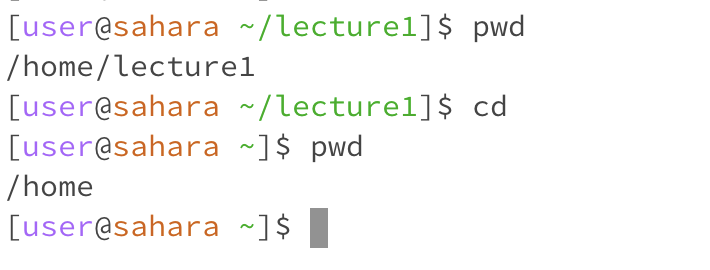
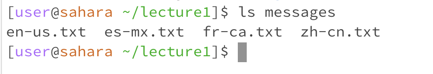
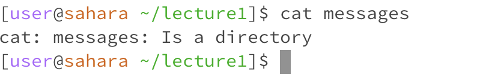

# **Christopher Schrader - CSE 15L Lab 1**

---

## `cd` examples:

*No argument:*

 
* The working directory was `/lecture1` at the time the command was run.
* After the command was run, the working directory changed to `/home`. This indicates that no argument with the `cd` command moves you to the home directory.
* This was not an error.

*Directory as argument:*

 
* The working directory was `/home` at the time the command was run.
* After the command was run, it changed the working directory to `/lecture1`. This is because our `/home` directory had a lecture1 directory, which was the argument passed to `cd`.
* This was not an error.

*File as argument:*

 
* The working directory was `/lecture1` at the time the command was run.
* The output "Not a directory" was displayed. I got this output because `cd` cannot take in a file as an argument, only directories.
* This was an error since we tried to change our directory to a file.

---

## `ls` examples:

*No argument:*

 
* The working directory was `/lecture1` at the time the command was run.
* We got this output since it was all the files and directories inside of our working directory.
* This was not an error.

*Directory as argument:*

 
* The working directory was `/lecture1` at the time the command was run.
* We got this output since it was all of the files inside of our target directory. We passed in messages as the argument to `ls`, printing out the files of that directory.
* This was not an error.

*File as argument:*

 
* The working directory was `/lecture1` at the time the command was run.
* The output I received was the name of the file I used as the argument.
* This was not an error.

---

## `cat` examples:

*No argument:*

 
* The working directory was `/lecture1` at the time the command was run.
* As I ran the command with no argument, I was able to type freely into the console continuously.
* This was an error. We did not specify a file name to edit or create.

*Directory as argument:*

 
* The working directory was `/lecture1` at the time the command was run.
* The output was, "Is a directory." This was shown because cat edits files, and does not take a directory as an argument.
* This was an error since cat is used on files, not directories.

*File as argument:*

 
* The working directory was `/lecture1` at the time the command was run.
* The output I received was the contents of the file I passed in as an argument. It printed out all of the Java code in my file.
* This was not an error.

