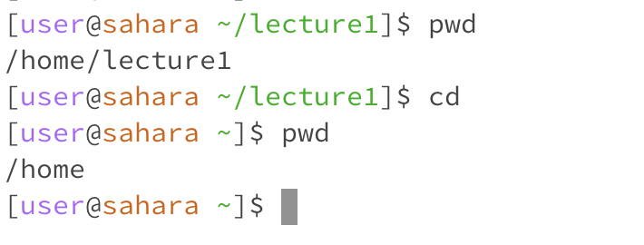
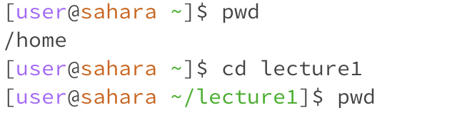
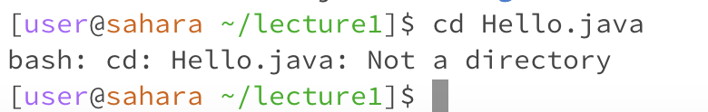
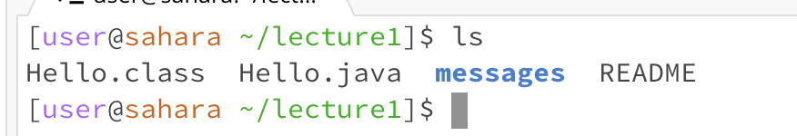
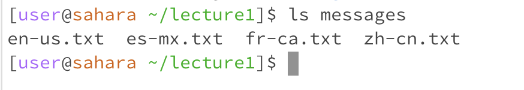
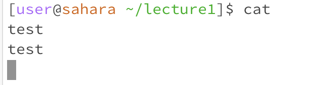
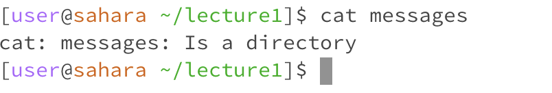
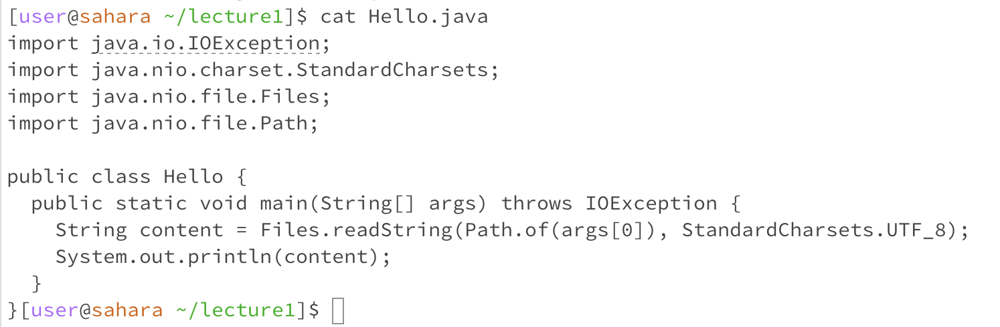

# **Christopher Schrader - CSE 15L Lab 1**

---

## cd examples:

*No argument:*

* 
* The working directory was /lecture1 at the time the command was run.
* After the command was run, the working directory changed to /home. This indicates that no argument with the cd command moves you to the home directory.
* This was not an error.

*Directory as argument:*

* 
* The working directory was /home at the time the command was run.
* After the command was run, it changed the working directory to /lecture1. This is because our /home/ directory had a lecture1 directory, which was the argument passed to cd.
* This was not an error.

*File as argument:*

* 
* The working directory was /lecture1 at the time the command was run.
* The output "Not a directory" was displayed. I got this output because cd cannot take in a file as an argument, only directories.
* This was an error since we tried to change our directory to a file.

---

## ls examples:

*No argument:*

* 
* The working directory was /lecture1 at the time the command was run.
* We got this output since it was all the files and directories inside of our working directory.
* This was not an error.

*Directory as argument:*

* 
* The working directory was /lecture1 at the time the command was run.
* We got this output since it was all of the files inside of our target directory. We passed in messages as the argument to ls, printing out the files of that directory.
* This was not an error.

*File as argument:*

* 
* The working directory was /lecture1 at the time the command was run.
* 

---

## cat examples:

*No argument:*

1. 

*Directory as argument:*

1. 

*File as argument:*

1. 

