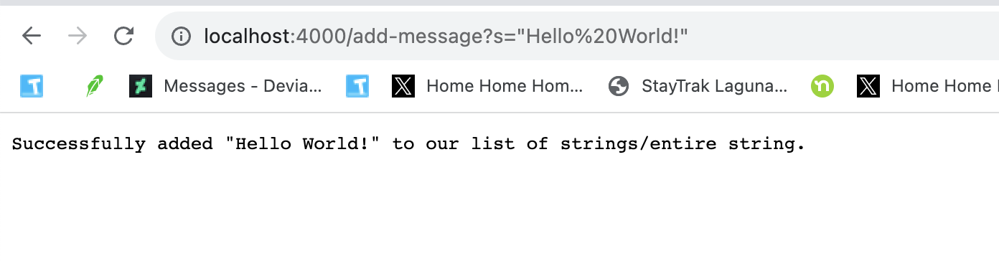
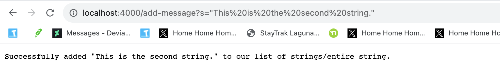
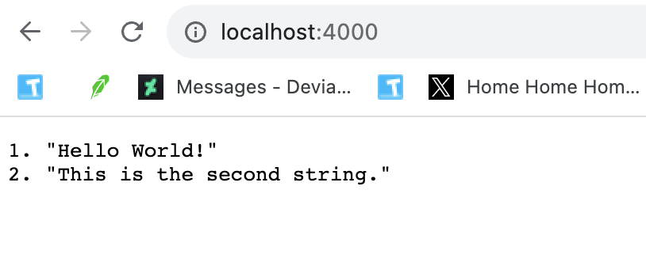
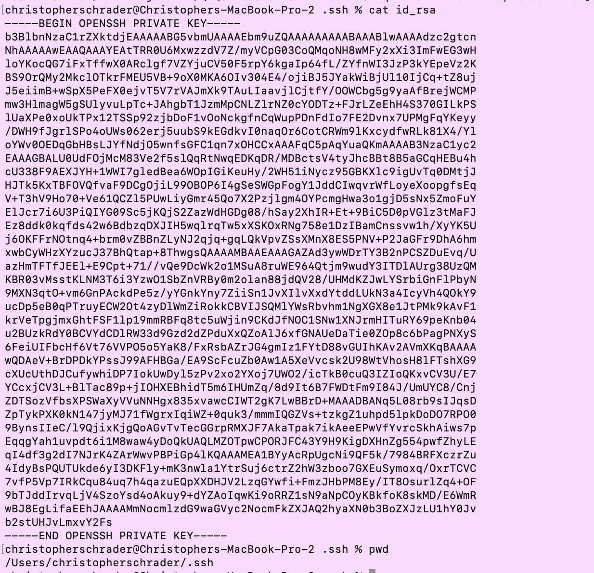
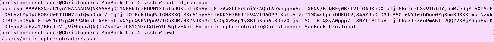
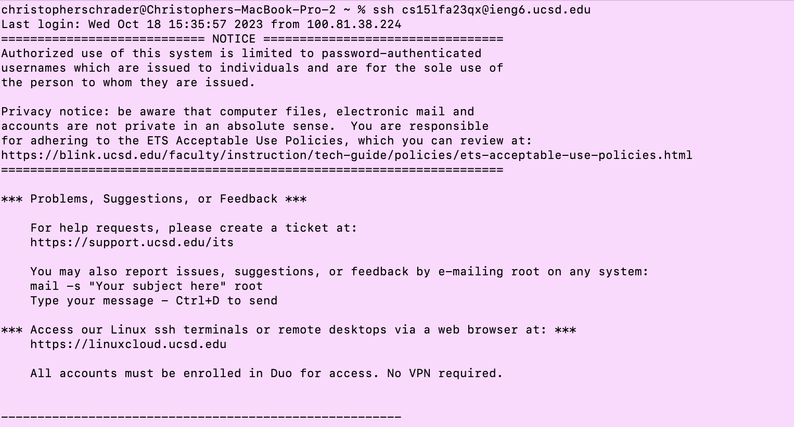

## Christopher Schrader - Lab Report 2 (Lab 3)

Code for `StringServer.java`:

```
import java.io.IOException;
import java.net.URI;

class Handler implements URLHandler {
    // The one bit of state on the server: a number that will be manipulated by
    // various requests.
    int num = 0;

    String wholeString = "";
    int numStrings = 0;

    public String handleRequest(URI url) {
        if (url.getPath().equals("/")) {
            //return the list of our strings
            return String.format("%s", wholeString);
        } else {
            if (url.getPath().contains("/add-message")) {
                String[] parameters = url.getQuery().split("=");
                if (parameters[0].equals("s")) {
                    numStrings++;
                    wholeString += numStrings + ". " + parameters[1] + "\n";
                    return String.format("Successfully added %s to our list of strings/entire string.", parameters[1]);
                }
            }
            return "404 Not Found!";
        }
    }
}

class StringServer {
    public static void main(String[] args) throws IOException {
        if(args.length == 0){
            System.out.println("Missing port number! Try any number between 1024 to 49151");
            return;
        }

        int port = Integer.parseInt(args[0]);

        Server.start(port, new Handler());
    }
}

```
---

##Part 1

Screenshot 1, using `/add-message?s="Hello World!"`:


1. There are multiple methods called in my code upon accessing this path with the given query. For one, `handleRequest()` is called, and numerous object methods are used, such as `url.getPath()`, `url.getQuery()`, and `String.format()`.
2. The argument to `handleRequest()` is `new URI("localhost:4000/add-message?s"Hello World!");`
   `.getPath()` returns the path specified, which is `/add-message`
   `.getQuery()` returns the specified query, which is `s="Hello World!"`
3. First, we increment the `int numStrings` field of the `Handler` class. 
   The field `String wholeString` inside the `Handler` class is updated with the `numStrings` field plus a period, the String after `=` in the query, as well as `\n`.

Screenshot 2, using `/add-message?s="This is the second string."`:


1. There are multiple methods called in my code upon accessing this path with the given query. For one, `handleRequest()` is called, and numerous object methods are used, such as `url.getPath()`, `url.getQuery()`, and `String.format()`.
2. The argument to `handleRequest()` is `new URI("localhost:4000/add-message?s"This is the second string.");`
   `.getPath()` returns the path specified, which is `/add-message`
   `.getQuery()` returns the specified query, which is `s="This is the second string."`
3. First, we increment the `int numStrings` field of the `Handler` class. 
   The field `String wholeString` inside the `Handler` class is updated with the `numStrings` field plus a period, the String after `=` in the query, as well as `\n`.

Screenshot 3, accessing the `/` path of the web server.


1. One method in the `Handler` class is called, `handleRequest()`, as well as `url.getPath()` and `String.format()`
2. The argument to `handleRequest()` is `new URI("localhost:4000/")`
   `.getPath()` returns `/`
3. None of the fields of my class are modified. We simply return the `String wholeMessage` field using `String.format()`

##Part 2

Path to my private key:


Path to my public key:


SSH without having to enter password:


##Part 3

This lab taught me several things I didn't know. I was not aware of how to setup SSH without having to enter a password, which I did by running `ssh-keygen` on my local machine and then using `scp` to move my public and private key to my remote ieng6 account. I also learned how to build a simple web server in Java and handling URL requests by processing a URI.
