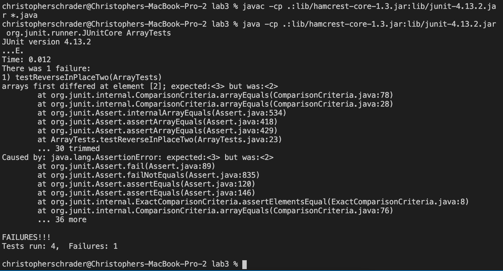

## Christopher Schrader - Lab Report 3
---

## Part 1
For part 1, I have chosen the faulty `reverseInPlace()` function from `ArrayExamples.java`

Failure inducing input using `{3, 5, 2}` as my array:

```
 @Test
  public void testReverseInPlaceTwo() {
    int[] input1 = { 3, 5, 2 };
    ArrayExamples.reverseInPlace(input1);
    assertArrayEquals(new int[]{2, 5, 3 }, input1);
  }
```

# Input that doesn't produce a failure using `{3}` as my array:

```
@Test 
	public void testReverseInPlace() {
    int[] input1 = { 3 };
    ArrayExamples.reverseInPlace(input1);
    assertArrayEquals(new int[]{ 3 }, input1);
	}
```

# Symptom:


# The bug:
The bug was that in the old code, the values of the array were being overwritten as the array was reversed. For example, when the last element was swapped with the first element, the first element was lost forever. I fixed the bug by keeping a temporary `int temp` variable that stores the value of the element at `arr[i]` so that we do not lose it and can put it at the corresponding opposite side of the array. We only loop up to the middle ement since once we get to that point the array has been successfully reversed.

Before code change:
```
  static void reverseInPlace(int[] arr) {
    for(int i = 0; i < arr.length; i += 1) {
      arr[i] = arr[arr.length - i - 1];
    }
  }
```

After code change:
```
  static void reverseInPlace(int[] arr) {
    for(int i = 0; i < arr.length / 2; i += 1) {
      int temp = arr[i];
      arr[i] = arr[arr.length - i - 1];
      arr[arr.length - i - 1] = temp;
    }
  }
```


