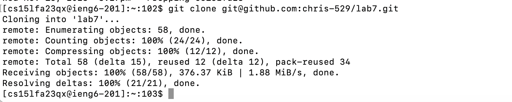
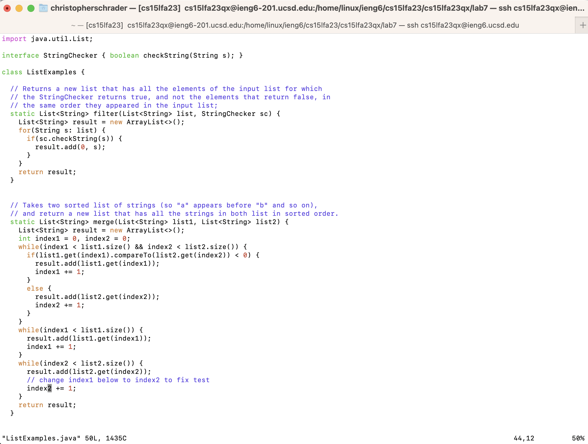

# Christopher Schrader - Lab Report 4 (VIM/Github)

# Steps 4-9 that we need to complete

## Step 4 (Log into ieng6)

Screenshot:


I pressed the following keys to get here:
```
<up><enter>
```
The ssh command `ssh cs15lfa23qx@ieng6.ucsd.edu` was 1 command up in my command history, so I only needed to press up once to get to it.

## Step 5 (Clone your fork of the repository from your Github account (using the SSH URL))

Screenshot:


I pressed the following keys to get here:
```
<up><up><up><up><up><up><up><up><up><up><up><up><up><up><up><up><up><up><up><up><up><up><up><up><up><up><up><up><enter>
```
The `git clone git@github.com:chris-529/lab7.git` was 28 commands up in my command history, so I pressed up 28 times to get to it.

## Step 6 (Run the tests, demonstrating that they fail)

Screenshot:


I pressed the following keys to get here:
```
cd lab7<enter>, javac -cp .:lib/hamcrest-core-1.3.jar:lib/junit-4.13.2.jar *.java<enter>, java -cp .:lib/hamcrest-core-1.3.jar:lib/junit-4.13.2.jar org.junit.runner.JUnitCore ListExamplesTests<enter>
```
I did not have these commands in my commands history, so I retyped them.

## Step 7 (Edit the code file to fix the failing test)

Screenshots:


I pressed the following keys to do this:
```
vim ListExamples.java<enter>
```
I did not have this in my command history so I retyped it.



I pressed the following keys to make this change:
`


