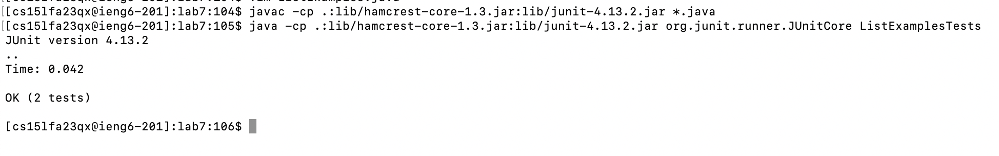
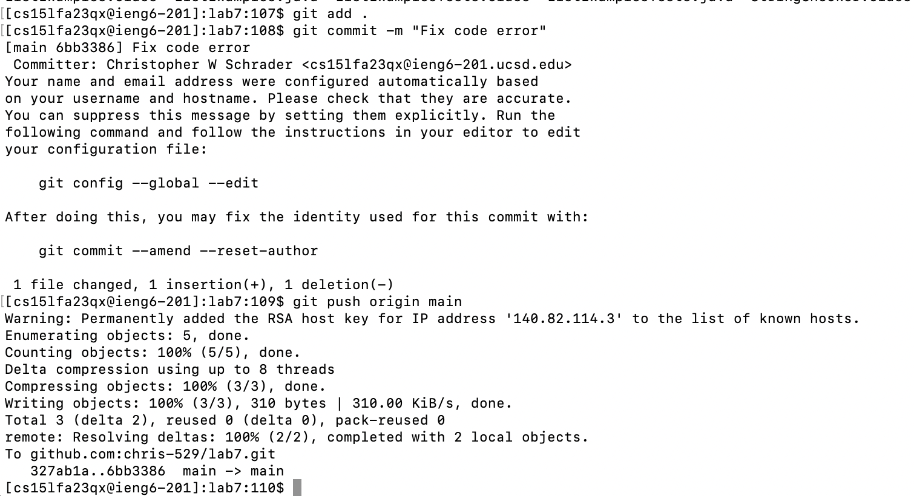

# Christopher Schrader - Lab Report 4 (VIM/Github)

# Steps 4-9 that we need to complete

## Step 4 (Log into ieng6)

Screenshot:


I pressed the following keys to get here:
```
<up><enter>
```
The ssh command `ssh cs15lfa23qx@ieng6.ucsd.edu` was 1 command up in my command history, so I only needed to press up once to get to it.

## Step 5 (Clone your fork of the repository from your Github account (using the SSH URL))

Screenshot:


I pressed the following keys to get here:
```
<up><up><up><up><up><up><up><up><up><up><up><up><up><up><up><up><up><up><up><up><up><up><up><up><up><up><up><up><enter>
```
The `git clone git@github.com:chris-529/lab7.git` was 28 commands up in my command history, so I pressed up 28 times to get to it.

## Step 6 (Run the tests, demonstrating that they fail)

Screenshot:


I pressed the following keys to get here:
```
cd lab7<enter>,
javac -cp .:lib/hamcrest-core-1.3.jar:lib/junit-4.13.2.jar *.java<enter>,
java -cp .:lib/hamcrest-core-1.3.jar:lib/junit-4.13.2.jar org.junit.runner.JUnitCore ListExamplesTests<enter>
```
I did not have these commands in my commands history, so I retyped them.
The first command steps into the lab7 directory
Then, the second command compiles all .java files in the current directory, plus
the `-cp` option to specify the path to JUnit.
Finally, the third command runs the program, specified with the `ListExamplesTests` class,
and additionally the JUnit path is specified with `-cp`

## Step 7 (Edit the code file to fix the failing test)

Screenshots:


I pressed the following keys to do this:
```
vim ListExamples.java<enter>
```
I did not have this in my command history so I retyped it.


I pressed the following keys to make this change:
```
/index1<enter>,n,n,n,n,n,n,n,n,9,e,r2,esc,:wq<enter>
```
First, I typed `/index1<enter>` to search for all instances of `index1` in my code. Then, I hit `n` 9 times until I got the line I needed to change.
I then typed `e` to get my cursor to the end of the word.
Finally, I typed `r2` to replace the character at my cursor to a 2, changing `index1` to `index2`.
To save and quit, I hit the `esc` key and then typed `:wq<enter>`.

## Step 8 (Run the tests, demonstrating that they now succeed)

Screenshot:


I pressed the following keys to make this change:
```
<up><up><up><up><up><up><up><up><up><up><up><up><up><up><up><up><up><up><up><up><enter>,<up><up><up><up><up><up><up><up><up><up><up><up><up><up><up><up><up><up><up><up><enter>
```
The `javac -cp .:lib/hamcrest-core-1.3.jar:lib/junit-4.13.2.jar *.java` command to recompile my code was 20 commands up in my history so I hit `<up>` 20 times to get to it and hit `<enter>`.
The `java -cp .:lib/hamcrest-core-1.3.jar:lib/junit-4.13.2.jar org.junit.runner.JUnitCore ListExamplesTests` command to run my tests was also 20 commands up in my history since we just ran a command before this. I then hit `<enter>` to run my tests.

## Step 9 (Commit and push the resulting change to your Github account)

Screenshot:


I pressed the following keys to make this change:
```
git add .<enter>, git commit -m "Fix code error"<enter>, git push origin main<enter>
```
I did not have either of these commands in my command history.
I first added my changed files to my staging area with my first command
Then I committed the files in my staging area with the second command
Finally, I pushed my commit to my remote repository on github with the third command


