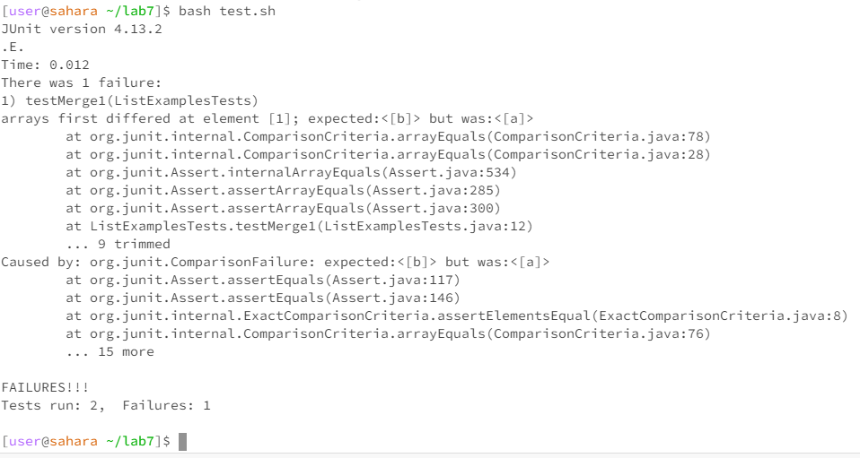
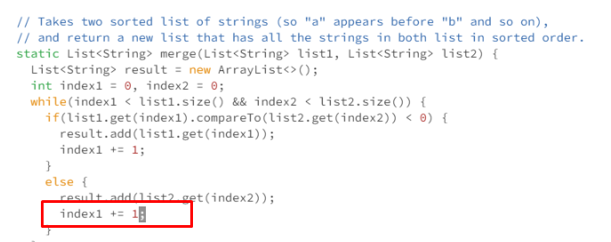

# Christopher Schrader - Lab Report 5

# Part 1

(Note that this code is from Lab 7 that I modified to break)

## 1. Edstem post

Hello class,

I recently was developing a merge function where two Lists are taken as inputs to my merge function, and a resulting single List that is composed of the two input Lists merged in alphabetical order is returned.
I ran my code by running `bash test.sh` that compiles my code and runs my JUnit test file, and it passed one test, but it does not pass the second test.

Test that passes:

Input Lists: `["a", "b", "c"]` and `["c", "d", "e"]`
Correct list returned and expected: `["a", "b", "c", "c", "d", "e"]`

Test that fails:

Input Lists: `["x", "y"]` and `["a", "b"]`
Expected list: `["a", "b", "x", "y"]`
Based on the output from my JUnit test, I think that my merge function is returning this wrong merged List as this, since it says it expected a 'b' but found an 'a':
Actual list returned: `["a", "a", "x", "y"]`

Based on the two different tests that worked and didn't work, I sense that it has something to do with not going past the 'a' in my second input List.

Running my code with `bash test.sh` and output:



My merge code:

```
import java.util.ArrayList;
import java.util.List;

interface StringChecker { boolean checkString(String s); }

class ListExamples {

  // Returns a new list that has all the elements of the input list for which
  // the StringChecker returns true, and not the elements that return false, in
  // the same order they appeared in the input list;
  static List<String> filter(List<String> list, StringChecker sc) {
    List<String> result = new ArrayList<>();
    for(String s: list) {
      if(sc.checkString(s)) {
        result.add(s);
      }
    }
    return result;
  }


  // Takes two sorted list of strings (so "a" appears before "b" and so on),
  // and return a new list that has all the strings in both list in sorted order.
  static List<String> merge(List<String> list1, List<String> list2) {
    List<String> result = new ArrayList<>();
    int index1 = 0, index2 = 0;
    while(index1 < list1.size() && index2 < list2.size()) {
      if(list1.get(index1).compareTo(list2.get(index2)) < 0) {
        result.add(list1.get(index1));
        index1 += 1;
      }
      else {
        result.add(list2.get(index2));
        index1 += 1;
      }
    }
    while(index1 < list1.size()) {
      result.add(list1.get(index1));
      index1 += 1;
    }
    while(index2 < list2.size()) {
      result.add(list2.get(index2));
      // change index1 below to index2 to fix test
      index2 += 1;
    }
    return result;
  }


}

```

Any ideas?

## 2. TA Response

Hello,

It looks like, yes, your code is not moving past the "a" String item in your second input list. How are you handling moving to the next element in a list once you've added one? Based on your input and output, it tells me that some index is not being incremented properly. Maybe try examining this part of your code?

## 3. Information received

Hi,

Thank you, that was the problem. I was improperly incrementing the index of index1 and not index2 once we merged an item from my second List to the merged List. Since I incremented index1 instead of index2 in this case, index2 always stayed 0 and when we used this index, it was always the first element in the list.

Bug in code:


## 4. 

Directory structure needed:
```
-lab7
  -lib
    -hamcrest-core-1.3.jar
    -junit-4.13.2.jar
  ListExamples.java
  ListExamplesTests.java
  test.sh
```
Contents of each file before fixing bug:
`ListExamples.java:`

```
import java.util.ArrayList;
import java.util.List;

interface StringChecker { boolean checkString(String s); }

class ListExamples {

  // Returns a new list that has all the elements of the input list for which
  // the StringChecker returns true, and not the elements that return false, in
  // the same order they appeared in the input list;
  static List<String> filter(List<String> list, StringChecker sc) {
    List<String> result = new ArrayList<>();
    for(String s: list) {
      if(sc.checkString(s)) {
        result.add(s);
      }
    }
    return result;
  }


  // Takes two sorted list of strings (so "a" appears before "b" and so on),
  // and return a new list that has all the strings in both list in sorted order.
  static List<String> merge(List<String> list1, List<String> list2) {
    List<String> result = new ArrayList<>();
    int index1 = 0, index2 = 0;
    while(index1 < list1.size() && index2 < list2.size()) {
      if(list1.get(index1).compareTo(list2.get(index2)) < 0) {
        result.add(list1.get(index1));
        index1 += 1;
      }
      else {
        result.add(list2.get(index2));
        index1 += 1;
      }
    }
    while(index1 < list1.size()) {
      result.add(list1.get(index1));
      index1 += 1;
    }
    while(index2 < list2.size()) {
      result.add(list2.get(index2));
      // change index1 below to index2 to fix test
      index2 += 1;
    }
    return result;
  }


}

```
`ListExamplesTests.java`:
```
import static org.junit.Assert.*;
import org.junit.*;
import java.util.*;
import java.util.ArrayList;


public class ListExamplesTests {
  @Test(timeout = 500)
  public void testMerge1() {
    List<String> l1 = new ArrayList<String>(Arrays.asList("x", "y"));
    List<String> l2 = new ArrayList<String>(Arrays.asList("a", "b"));
    assertArrayEquals(new String[]{ "a", "b", "x", "y"}, ListExamples.merge(l1, l2).toArray());
  }

  @Test(timeout = 500)
  public void testMerge2() {
    List<String> l1 = new ArrayList<String>(Arrays.asList("a", "b", "c"));
    List<String> l2 = new ArrayList<String>(Arrays.asList("c", "d", "e"));
    assertArrayEquals(new String[]{ "a", "b", "c", "c", "d", "e" }, ListExamples.merge(l1, l2).toArray());
  }


}
```
`test.sh:`
```
javac -cp .:lib/hamcrest-core-1.3.jar:lib/junit-4.13.2.jar *.java
java -cp .:lib/hamcrest-core-1.3.jar:lib/junit-4.13.2.jar org.junit.runner.JUnitCore ListExamplesTests
```

Command I used to trigger the bug: `bash test.sh`

How to fix the bug:
In the file `ListExamples.java`, we were incorrectly incrementing index1 when we needed to increment index2 after adding an element from the second input List. To fix this, open the file using `vim ListExamples.java`, enter Insert mode by pressing `i`, and go to line 34 in the first `else` statement inside of the `merge` function and replace `index1 += 1` with `index2 += 2`. Then, exit and save the program by hitting `ESC` and typing `:wq`

# Part 2

In the second half of this quarter, I learned a lot of useful things from our labs.
One thing I learned that I didn't know before was how to use jdb to find values of variables WHILE my program is running. Before, I used a bunch of print statements to find these values. Now, I know that I can just use jdb and step through my program to debug.
